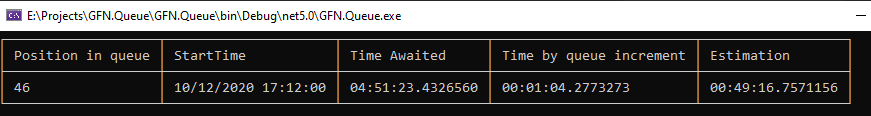
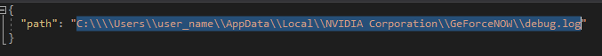

# GFN.Queue

## How to use

Download the [latest release](https://github.com/Sulexa/GFN.Queue/releases)

Unzip it

Edit the file called appsettings.json

set the path to you GFN debug path

for me it's this : C:\\\\\\\\Users\\\\user_name\\\\AppData\\\\Local\\\\NVIDIA Corporation\\\\GeForceNOW\\\\debug.log

**(You need to double every \ )**

Launch the GFN.Queue.exe
